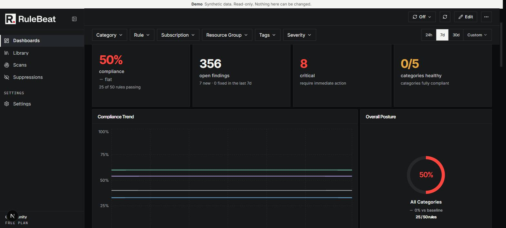
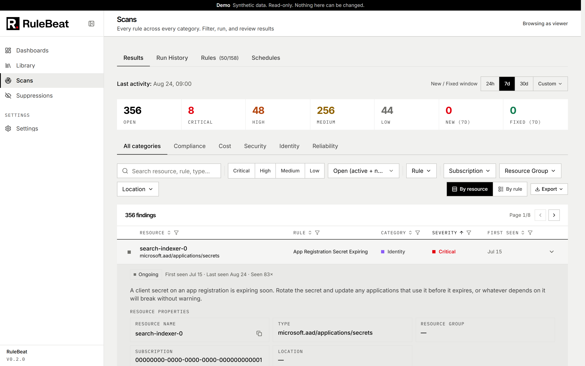
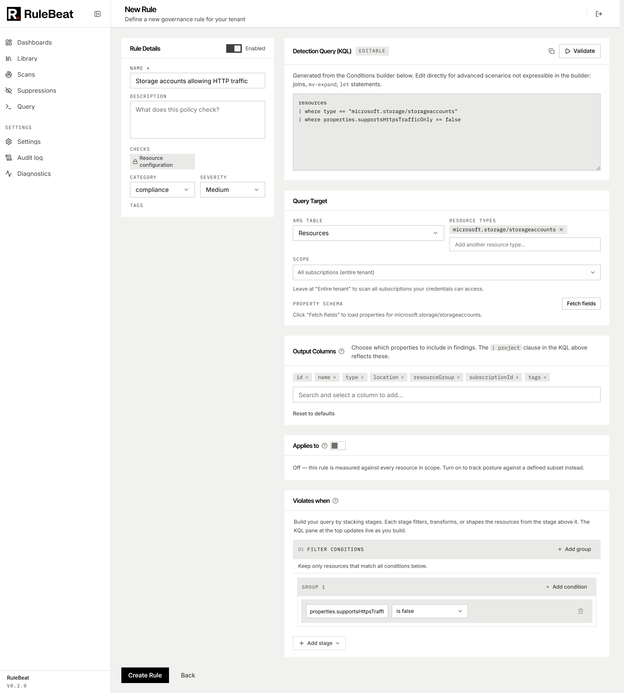
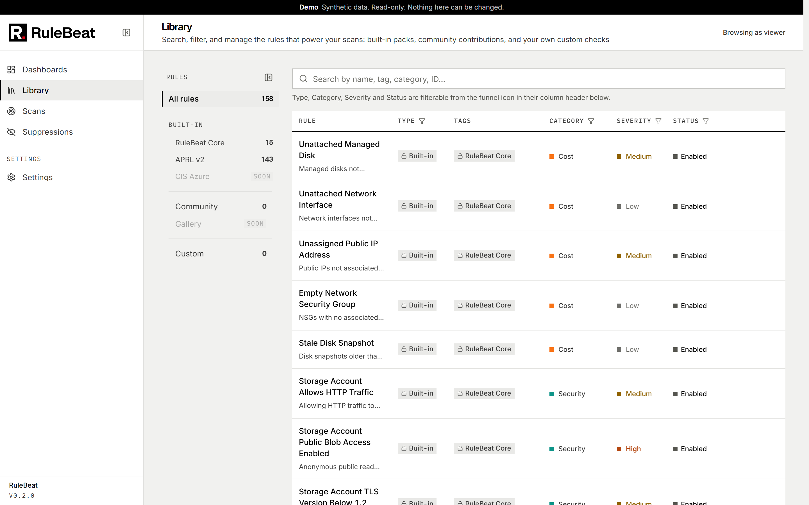
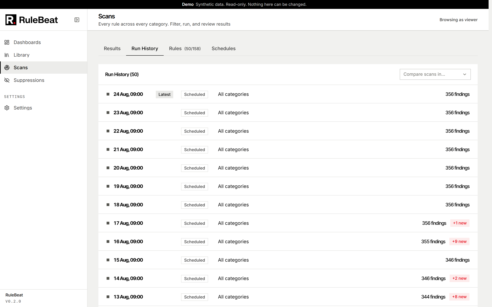
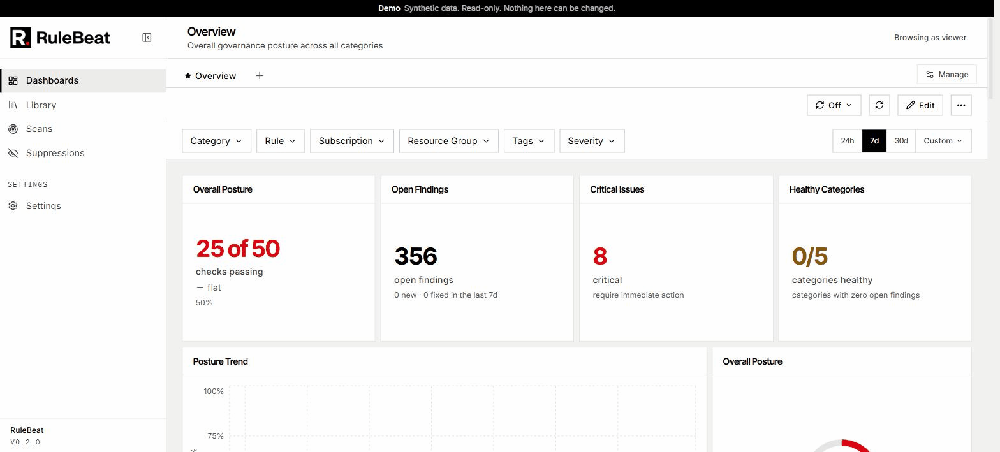

<div align="center">

<picture>
  <source media="(prefers-color-scheme: dark)" srcset="brand/lockup/rulebeat-lockup-dark-306.png">
  
</picture>

<h3>Azure governance checks you write, run on a schedule</h3>

<p>
A self-hosted governance scanner for Azure: one Docker container you run in your own subscription.<br>
Your rules describe what should not exist in your estate. RuleBeat finds where it does,<br>
and tracks every finding from first seen to fixed.
</p>

<p>
<a href="https://docs.rulebeat.com"><b>Documentation</b></a>
&nbsp;·&nbsp;
<a href="#quick-start"><b>Quick start</b></a>
&nbsp;·&nbsp;
<a href="docs/public/demo-mode.md"><b>Demo mode</b></a>
&nbsp;·&nbsp;
<a href="https://github.com/rulebeat/rulebeat/issues/new"><b>Report a bug</b></a>
&nbsp;·&nbsp;
<a href="https://github.com/rulebeat/rulebeat/issues/new"><b>Request a feature</b></a>
</p>

<p>
<a href="https://github.com/rulebeat/rulebeat/actions/workflows/ci.yml"></a>
<a href="https://github.com/rulebeat/rulebeat/releases"></a>
<a href="LICENSE"></a>
<a href="https://github.com/rulebeat/rulebeat/pkgs/container/rulebeat"></a>
</p>

<p>
<a href="https://docs.rulebeat.com"></a>
<a href="https://rulebeat.com"></a>
<a href="CHANGELOG.md"></a>
<a href="https://github.com/rulebeat/rulebeat/issues"></a>
</p>

</div>



A rule is a check you author against Azure Resource Graph or Microsoft Graph, in a visual builder
or as raw KQL. Built-in and custom rules share one scan, history, suppression, dashboard and
notification workflow.

RuleBeat is read-only by design. It scans with a Reader credential you provide, never holds write
access, and never blocks a deployment. It is open source (Apache-2.0) and free.

---

**Contents:** [Quick start](#quick-start) · [The problem](#the-problem) ·
[What it does](#what-it-does) · [Why not just use...](#why-not-just-use) ·
[A closer look](#a-closer-look) · [Connect Azure](#connect-azure) ·
[Microsoft sign-in](#optional-microsoft-sign-in) · [Local development](#local-development) ·
[How it works](#how-it-works) · [Status](#status) · [Contributing](#feedback--contributing)

## Quick start

You need Docker, and an Azure subscription with at least Reader access if you want to connect real
Azure data (you can also explore the UI without connecting anything).

1. Start the container.

   bash or zsh:

   ```bash
   docker run -d --name rulebeat --restart unless-stopped -p 127.0.0.1:3000:3000 \
     -v rulebeat-data:/app/packages/web/data \
     -e AUTH_URL=http://localhost:3000 \
     ghcr.io/rulebeat/rulebeat:0.2.4
   ```

   PowerShell:

   ```powershell
   docker run -d --name rulebeat --restart unless-stopped -p 127.0.0.1:3000:3000 `
     -v rulebeat-data:/app/packages/web/data `
     -e AUTH_URL=http://localhost:3000 `
     ghcr.io/rulebeat/rulebeat:0.2.4
   ```

2. Read the generated admin password. It is written to the data volume, never to the container
   logs, so it does not outlive the forced password change in your log history:

   ```
   docker exec rulebeat cat data/initial-password.txt
   ```

3. Open `http://localhost:3000`, sign in, and change the password when prompted. A
   <!-- count:onboarding-steps -->four-step wizard then connects Azure, verifies what your
   credential can actually reach, lets you choose what to scan, and runs your first scan. The
   wizard asks for a read-only Azure identity; [Connect Azure](#connect-azure) below lists the
   ways to supply one.

The app binds to `127.0.0.1` on purpose: RuleBeat holds a live Azure read credential, so the
default is reachable from this host only. To reach it from another machine, put a reverse proxy
with TLS in front; see
[`docs/public/configure.md`](docs/public/configure.md#exposing-it-beyond-localhost).

`AUTH_URL` names the address RuleBeat treats as its own. Use `localhost`, not `127.0.0.1`:
Microsoft sign-in only accepts a redirect URI over HTTPS or on `http://localhost`, and the
sign-in flow builds that URI from `AUTH_URL`. Details in
[`docs/public/install.md`](docs/public/install.md).

The commands above pin the newest release and are rewritten automatically when one ships, so a
copied command installs a known version. `:latest` tracks the same image if you prefer a floating
tag, and every release keeps its own version tag on the
[releases page](https://github.com/rulebeat/rulebeat/releases). A running instance shows its
version in the sidebar footer and on the Diagnostics page's System card. Upgrading, backup, arriving pre-configured via environment
variables, and building the image from source are all in
[`docs/public/install.md`](docs/public/install.md).

<details>
<summary>Prefer Docker Compose?</summary>

Save this as `docker-compose.yml` and run `docker compose up -d`:

```yaml
services:
  rulebeat:
    image: ghcr.io/rulebeat/rulebeat:0.2.4
    restart: unless-stopped
    ports:
      - "127.0.0.1:3000:3000"
    environment:
      AUTH_URL: http://localhost:3000
    volumes:
      - rulebeat-data:/app/packages/web/data
volumes:
  rulebeat-data:
```

The repo's own [`docker-compose.yml`](docker-compose.yml) is the long-form version of this file:
it builds from source (`build: .`) and documents every environment variable RuleBeat reads, each
one optional, with a comment saying what it is for.

</details>

## The problem

Every platform team knows what should not exist in its Azure estate: resources nobody owns,
storage open to the internet, names that break the convention, required tags that are missing.
Azure gives those checks no first-class home. They live in someone's head, in a script only its
author runs, or in a wiki page that went stale the month it was written, and they surface only
when something breaks.

RuleBeat is that home. Each rule describes one thing that should not exist, every scan finds where
it does, and a rule that comes back clean is a standard being met. The history shows whether the
estate is getting better or worse.

The same mechanism pays out in every direction your rules point. Orphaned resources stop billing
unnoticed. Quiet security misconfigurations surface before an incident does, and tag standards
hold without anyone chasing people. App credentials get rotated before an integration fails, and
Microsoft's resiliency guidance runs as scheduled checks instead of being read once. The long form
of what each category buys you is in
[`docs/public/why-run-rulebeat.md`](docs/public/why-run-rulebeat.md).

## What it does

- **Rules you write, against two kinds of data.** A rule checks either *resource configuration*
  (Azure Resource Graph, built visually or as raw KQL) or *directory objects* (Microsoft Graph:
  applications, service principals, users, groups and more, with an OData filter). A third kind,
  *logs and activity* (Log Analytics), is visible in the rule picker but not yet available. Every
  row a query returns is a finding; there is no separate in-memory evaluation that could disagree
  with what the same query shows you in the Azure Portal.
- <!-- count:checks-total -->**158 checks out of the box.** <!-- count:builtin-rules -->15 written
  for RuleBeat plus <!-- count:pack-rules:aprl-v2 -->143 from the
  [Azure Proactive Resiliency Library](https://azure.github.io/Azure-Proactive-Resiliency-Library-v2/)
  (APRL), version-pinned to the upstream commit recorded in the pack manifest. A fresh install
  enables <!-- count:enabled-default -->12 of them so the first scan is a useful signal rather than
  a wall of findings. Everything else is one click away in the Rules tab.
- **A visual rule builder that round-trips with raw KQL.** Build a check by picking scope, resource
  type and conditions, or paste a query copied from the Portal and have it parsed back into the
  builder. What the builder cannot express is kept verbatim as a read-only condition, never
  dropped. See [`docs/public/authoring-rules.md`](docs/public/authoring-rules.md).
- **"X of Y passing", honestly counted.** A rule counts as passing only when it has zero active
  findings *and* its last run actually succeeded. A rule that has not run, whose query failed, or
  whose result was capped is shown as unknown, never as passing. Per-rule outcomes and a
  complete/partial coverage badge on every run make that visible. See
  [`docs/public/posture.md`](docs/public/posture.md).
- **"Applies to" populations.** A rule can define the population it is measured against, so a
  finding reads "3 of 40 affected" instead of a bare count.
- **A findings lifecycle, not a scan diff.** Every finding is keyed on rule plus resource, tracked
  as new, active or fixed over time, and can be suppressed with a reason and an optional expiry.
  Export as CSV or JSON.
- **Manual and scheduled scans** with an Outlook-style recurrence engine (once, hourly, daily,
  weekly, monthly, with intervals and end conditions), targeting everything, categories, tags, or
  specific rules. Runs never overlap.
- <!-- count:widget-types -->**12 dashboard widget types**: the Overall Posture ring, trend lines,
  category and subscription scorecards, top rules and resources, severity breakdown, coverage and
  freshness, new-versus-fixed velocity, activity occurrences, stat cards and a recent findings feed.
  Filter a whole dashboard by category, subscription, resource group, tag, severity, rule or date
  window; build as many dashboards as you need.
- **Notifications to <!-- count:channel-types -->four channel types** (Microsoft Teams, Slack, a
  generic webhook, or email), chosen per schedule with a severity threshold, with retry on
  transient failures and a delivery history you can read.
- <!-- count:roles -->**Three roles** (viewer, editor, admin) enforced on every API route, not just
  in the UI, resolved from the database on every request, with an audit log covering every change.
  Sign in with local accounts or Microsoft Entra ID.
- **Installs as one container.** A generated admin password, a
  <!-- count:onboarding-steps -->four-step onboarding wizard that verifies what your credential can
  actually reach, a diagnostics page for the support questions, and a demo mode that runs against
  synthetic data with no Azure access at all.

## Why not just use...

- **Azure Policy.** Policy is Azure's enforcement layer: it evaluates definitions inside the
  control plane and can audit, deny or modify a resource at deployment time. RuleBeat is
  independent of it and does a different job: your own checks, run by your own service on a
  schedule, with history, suppressions and dashboards. Teams run both, and neither needs the
  other. What you learn in RuleBeat can inform a Policy definition, but nothing in RuleBeat
  assumes you ever write one.
- **Defender for Cloud or Azure Advisor.** Both are valuable and both are security-first or
  recommendation-first. Neither lets you write a check against your own tag standard, naming
  convention or internal rule and then schedule it, suppress the known cases and watch the trend.
  RuleBeat's custom rules cover cost, reliability, identity and compliance as well as security, and
  it is self-hosted with no vendor telemetry.
- **A spreadsheet or a one-off script.** Works fine until a second person needs to run it, or until
  you need history, scheduling, or an audit trail. RuleBeat gives you all three from day one.

## A closer look

| | |
|:--|:--|
|  |  |
| **Findings.** Every row a rule returns, with its age, severity and the rule's own recommendation. | **The rule builder.** Scope, resource type and conditions, round-tripping with the raw KQL. |
|  |  |
| **The library.** RuleBeat's own rules and the APRL pack, side by side. | **Run history.** What ran, how long it took, and whether the coverage was complete. |



There is no hosted demo instance yet. The fastest way to see RuleBeat is to run it yourself; the
[quick start](#quick-start) above takes about five minutes. To show it to someone without
connecting an Azure tenant at all, run it in [demo mode](docs/public/demo-mode.md).

## Connect Azure

RuleBeat needs a read-only identity to scan with. Connect one from Settings → Azure connection
after signing in, or supply it as an environment variable so the container arrives pre-configured.
Either way, RuleBeat never creates this identity for you. See
[`docs/public/permissions.md`](docs/public/permissions.md) for the exact `az` commands and Portal
steps to create a service principal with Reader and grant it.

Five ways to supply the credential, ranked best first:

| Option | How | Why |
|---|---|---|
| Managed identity | Automatic when RuleBeat itself runs on Azure (VM, AKS, Container Apps) | No secret exists anywhere |
| Workload identity federation | `AZURE_FEDERATED_TOKEN_FILE` | No secret, and works off-Azure too (AKS workload identity, federated CI) |
| Certificate | `AZURE_CLIENT_CERTIFICATE_PATH` | A secret exists, but not a shared one |
| Client secret, mounted file | `AZURE_CLIENT_SECRET_FILE` | Rotatable without recreating the container, not visible in `docker inspect` |
| Client secret, plain variable | `AZURE_CLIENT_SECRET` | Works everywhere, weakest option |

A password-protected certificate file also takes `AZURE_CLIENT_CERTIFICATE_PASSWORD`; that
variable is read by the Azure SDK itself, not by RuleBeat.

If you go the service principal route, this one line works in bash, zsh and PowerShell (replace
`<subscription-id>` first):

```
az ad sp create-for-rbac --name rulebeat-reader --role Reader --scopes /subscriptions/<subscription-id>
```

Full detail, including the optional Microsoft Graph permission for Directory rules, is in
[`docs/public/permissions.md`](docs/public/permissions.md).

## Optional: Microsoft sign-in

If you would rather your team sign in with their work accounts than a shared local password,
configure Microsoft Entra ID from Settings → Sign-in once you are in, or set it up ahead of time
with environment variables. See [`.env.example`](.env.example) and
[`docs/public/configure.md`](docs/public/configure.md). If you already connected Azure with an app
registration, the sign-in screen offers a checkbox to reuse it, so you do not have to register a
second Entra app just for sign-in.

## Local development

```bash
npm install
npm run build:core      # build packages/core before running or typechecking web
npm run dev             # http://localhost:3000
```

Copy `.env.example` (repo root) to `packages/web/.env.local` and fill in values. Run `az login`
for local Azure credential access. Outside a container, `DefaultAzureCredential` falls back to your
own CLI session if nothing else is configured.

```bash
npm test                # everything, both packages
npm run test:watch      # watch mode while working
npm run typecheck       # typecheck both packages, from the repo root
```

## How it works

A browser action, like running a scan or saving a rule, goes through a Next.js API route, which
resolves an Azure credential from exactly one place and hands the rule to the engine for its query
backend. A Resource Graph rule runs as the KQL compiled from its conditions (or its raw KQL); a
Directory rule runs as a Microsoft Graph query. The two engines are separate code paths that share
one contract: every returned row is a finding, and every rule ends with exactly one outcome
(success, failed, capped, or invalid), so one rule's failure never hides behind another's success.

Findings persist in a lifecycle table (new, active, fixed) keyed on rule plus resource, and that is
what the Results tab, the dashboards and the trend snapshots all read from. Everything lives in a
SQLite database inside your own deployment; secrets you enter are encrypted at rest. See
[`docs/public/how-it-works.md`](docs/public/how-it-works.md) for the full request path, and
[`docs/public/README.md`](docs/public/README.md) for the index of every guide: installation,
configuration, authoring rules, posture, dashboards, suppressions, notifications, roles, security,
troubleshooting and worked examples. The same pages are published, searchable, at
[docs.rulebeat.com](https://docs.rulebeat.com). [`docs/public/security.md`](docs/public/security.md) covers
what RuleBeat reads, what it stores, and what it never does; [`SECURITY.md`](SECURITY.md) is how to
report a vulnerability.

## Status

RuleBeat is in public beta. The core product (scanning, rules, dashboards, scheduling,
notifications, RBAC, audit logging) is built and in daily use. Logs and activity rules and
generated remediation steps are designed but not yet built, and the docs say so plainly wherever
they come up.

The software is free, during beta and after; see License below. Right now this
is a feedback-gathering phase. If something breaks, is confusing, or is missing something you would
need to actually adopt this, [open an issue](https://github.com/rulebeat/rulebeat/issues).

## Feedback & contributing

See [`CONTRIBUTING.md`](CONTRIBUTING.md). Short version: the whole platform is open and
community-contributed under Apache-2.0. [Open an issue](https://github.com/rulebeat/rulebeat/issues)
with bug reports, feature requests, or rule ideas, or open a pull request directly.
[`SUPPORT.md`](SUPPORT.md) says where to ask questions; everyone interacting in the project's
spaces is expected to follow the [code of conduct](CODE_OF_CONDUCT.md).

## Sponsors

RuleBeat is free and stays that way regardless of sponsorship.
[Sponsoring on GitHub](https://github.com/sponsors/abdohanafy) funds the time behind it: triaging
issues, reviewing pull requests, writing new rules, and building out the pipeline beyond the core.
It unlocks nothing in the software; see [`SPONSORS.md`](SPONSORS.md) for the full list.

---

## License

RuleBeat's license is Apache-2.0, covering the whole platform. The [`LICENSE`](LICENSE) file beside
this README is what governs the copy you are
reading. The rules and content shipped with RuleBeat may carry their own separate license.
