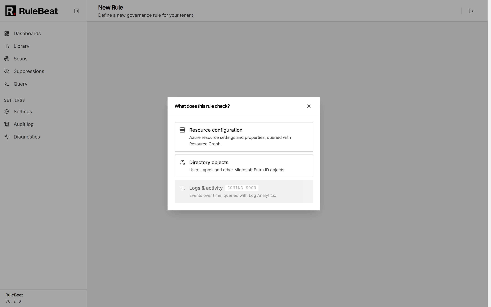

# Authoring rules


A rule is a check that turns every row or object it returns into a finding. Creating one starts with
**"What does this rule check?"**, which has three answers: **Resource configuration** (Azure Resource
Graph, the subject of this page), **Directory objects** (Microsoft Graph, see
[`directory-rules.md`](directory-rules.md)), and **Logs & activity**, which is visible in the picker
but not available yet.



Whichever you pick, the rule lands in the same Rules tab, runs in the same scans, and can be
suppressed, scheduled, dashboarded and notified on the same way. The backend changes how a rule is
written and run, not what you can do with its results.

## Scope

Every Resource configuration rule targets one of four levels. **Resource** (most common) runs against
`Resources` in Azure Resource Graph, optionally narrowed to specific resource types. **Resource
group**, **Subscription** and **Management group** run against that entity itself rather than its
contents, for checks like "every resource group must have a team tag". A resource-level rule can be
scoped further to specific subscriptions or management groups, so one rule can apply only to
production without a copy per environment.

## Conditions

Conditions are field, operator, value triples combined with and/or and optionally grouped. The visual
builder offers <!-- count:visual-operators -->34 operators:

| Group | Operators |
|---|---|
| Presence | `exists`, `isNull`, `isEmpty`, `isTrue`, and their opposites |
| Equality and text matching | `equals`, `contains`, `startsWith`, `endsWith`, `matchesRegex`, and their opposites |
| Set membership | `in`, `has`, `hasAny`, and their opposites |
| Numeric and date comparison | `gt`, `gte`, `lt`, `lte`, `between`, `olderThanDays`, `withinLastDays` |
| Array shape | `arrayEmpty`, `arrayLengthGt`, `arrayContains`, and related checks |

Fields can be top-level resource properties (`name`, `location`, `type`, `kind`), nested ones
(`properties.something`), or tags (`tags.owner`). The field picker is fed by the ARM provider aliases
API, the same source Azure Policy uses, so it offers a resource type's real properties rather than
whatever happened to be set on the resources you sampled.

Conditions describe what makes a resource **non-compliant**. A rule requiring an `owner` tag is
written as "flag anything where the `owner` tag does not exist", and the query it compiles to is that
violation query directly, so a rule's generated KQL reads as the negation of the requirement. A rule
scoped to virtual machines whose one condition is `tags['owner']` **is empty** compiles to this,
shown live in the editor's query pane:

```kql
Resources
| where type in~ ('microsoft.compute/virtualmachines')
| where isempty(tostring(tags['owner']))
| project id, name, type, location, resourceGroup, subscriptionId, tags
```

Every row it returns becomes one finding, carrying the resource id, name, type, resource group,
subscription and a portal link, with `tags` in its evidence because the query projects it. Fix the
tags and the next successful scan marks each one fixed.

## Applies to

By default a rule is measured against every resource in its scope, so three findings means three
things wrong. Some rules are really assertions about a smaller population, where a bare count stops
being useful: three findings out of three production VMs is a problem, three out of four hundred VMs
is probably already handled.

Applies to is an optional second query defining that population, built with the same builder. Turn it
on and RuleBeat runs it as its own count, showing "3 of 40 affected" instead of "3 resources
affected". For "every VM in a production resource group must carry an `owner` tag", it is the rule
above plus Applies to set to `resourceGroup` **starts with** `prod-`, which compiles to

```kql
Resources
| where type in~ ('microsoft.compute/virtualmachines')
| where resourceGroup startswith 'prod-'
| count
```

Note what the violation query does **not** do: it does not restrict itself to `prod-` resource
groups, so a VM in `dev-sandbox` without an owner tag is still flagged. To make the rule only look at
production, put the resource-group condition under Violates when as well. Applies to is the
denominator, not a filter, and it is a Resource configuration feature only.

## Raw KQL

Any Resource configuration rule can be authored as raw KQL instead of, or alongside, structured
conditions. This is the escape hatch for joins, aggregations, computed columns, or anything Azure
Resource Graph supports that does not map onto a simple filter. A rule with neither structured
conditions nor raw KQL would match every resource in scope, so RuleBeat refuses it, and a raw-KQL
rule whose rows carry no `id` column is refused at save time because every row would collapse onto
one finding.

RuleBeat's KQL parser aims to never lose anything. Most real-world KQL you paste in either maps onto
the builder's fields and operators or is preserved verbatim as a read-only passthrough condition, so
you can switch between the visual and raw views without losing a clause. Measured across the
<!-- count:pack-rules:aprl-v2 -->143 rules in the APRL pack, two still lose a filter line on the
round trip, and a few edge cases (values containing the literal ` and ` or ` or `, a trailing
`| limit` stage) are still being hardened. If a saved rule's raw KQL looks different from what you
pasted, treat it as a bug report.

The editor's Validate action runs a rule's actual query against your connected Azure identity and
shows what it would currently match, so you can check precision before turning it on.

## Directory rules in one paragraph

A Directory rule picks one of <!-- count:graph-resource-types -->seven object types (users, groups,
applications, service principals, directory roles, devices, administrative units) and an optional
OData `$filter` such as `accountEnabled eq false`, and every object returned becomes a finding. Which
types return data depends on the Graph permission you granted. Turning on "Flag expiring items" makes
a rule look inside a named array field, read a date field on each entry, and turn every entry within
a chosen number of days into its own finding at a severity you set per band. RuleBeat's
<!-- count:credential-expiry-rules -->two built-in credential-expiry checks are ordinary rules built
this way. The full guide is [`directory-rules.md`](directory-rules.md).

## Rule provenance

Every rule has a `type`: `builtin` (shipped with RuleBeat, including the
<!-- count:pack-rules:aprl-v2 -->143-rule Azure Proactive Resiliency Library pack, pinned to a named
upstream commit), `community`, or `custom`. Built-in rules can be disabled or have their severity and
tags edited, but not overwritten, so an update never silently discards a change you made. Custom
rules are entirely yours; duplicate any rule to start one from it.

Tags are free-form labels (`mcsb:*` for Microsoft Cloud Security Benchmark mappings, or your own
convention) used for filtering, dashboard scoping and schedule targeting. They are independent of
category, so a rule can be in the security category and also carry `framework:iso27001`.
