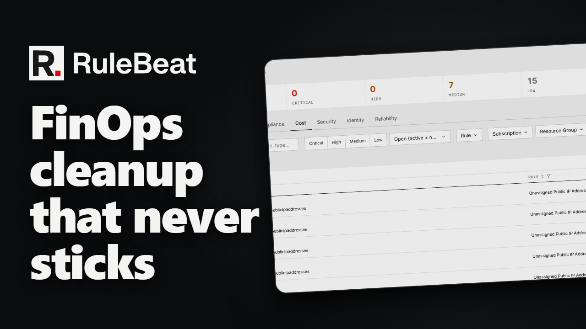

# How it works

What happens between a rule you wrote and a finding on the Scans page, described against the shipped
code so every claim here can be checked.

<!-- tutorial:finops-cleanup (generated by the tutorial publish sync from the series feature index; edit the index, not this block) -->

[](https://youtu.be/1ToeGihqaAI)

▶ **Watch:** [The FinOps cleanup that never sticks](https://youtu.be/1ToeGihqaAI), 2 min.

<!-- /tutorial:finops-cleanup -->

```
 browser
   |  POST /api/scans/run            (manual: Run Scan button)
   |  scheduler tick, every 30s      (scheduled: a due schedule)
   v
 run executor (lib/run-executor.ts)
   |  one run, recorded in schedule_runs; busy flag so runs never overlap
   v
 per category: runCategoryScan (lib/scan-runner.ts)
   |  enabled rules partitioned by Rule.queryBackend
   |
   |-- resource-graph  --> runRules()       (core engine/runner.ts)       --> Azure Resource Graph
   |-- microsoft-graph --> runGraphRules()  (core engine/graph-runner.ts) --> Microsoft Graph
   |-- log-analytics   --> runLawRules()    (core engine/law-runner.ts)   --> Log Analytics
   |
   |  each rule yields findings, then exactly one outcome:
   |  success | failed | capped | invalid
   v
 save scan + sync findings (lib/db/findings.ts)
   |  upsert into the findings table by fingerprint; resolve only on success
   v
 posture snapshots refreshed for the categories the sync touched (lib/db/snapshots.ts),
 after the sync commits; the daily snapshot keeps the trend
```

Every Azure call uses one identity, resolved in one place (`packages/web/lib/azure-credential.ts`):
environment variables first, then a credential an admin entered under Settings, then managed identity
or the local `az login` session. The user who clicked Run Scan is never the identity that scans.

## Three engines, not one engine with a branch

A rule carries a `queryBackend`, and three values run today.

**`resource-graph`.** The rule is, or compiles to, a KQL query against Azure Resource Graph.
`runRules()` sends it with the rule's scope passed as a request parameter rather than written into
the KQL, and treats **every row that comes back as a finding**. There is no in-memory evaluator
re-checking rows against the conditions: the query is the rule, so what the builder shows and what
Azure returns cannot disagree. A raw KQL rule missing `type`, `location`, `resourceGroup` or
`subscriptionId` gets them backfilled, three from parsing the ARM resource id and `location` from one
follow-up query, never by rewriting the rule's own KQL.

**`microsoft-graph`.** The rule is a Graph request: one of
<!-- count:graph-resource-types -->seven allowlisted object types, an optional OData `$filter`, and
optionally an expansion turning entries inside an array field into their own findings.
`runGraphRules()` is a separate engine rather than a branch because a directory object is not an ARM
resource: it has no subscription, resource group or location, and the first engine's ARM-shaped
assumptions would be wrong for it. See [`directory-rules.md`](directory-rules.md).

**`log-analytics`.** The rule is a KQL query against a Log Analytics workspace, and each row is an
*activity* finding: there is no resource id, so a finding's identity is the rule's optional dimension
column, and a row where that column is blank makes the rule `invalid`. `runLawRules()` is its own
engine for the same reason as the second one. Authoring is paused: the new-rule picker shows the
option as unavailable ([`permissions.md`](permissions.md#4-optional-log-analytics-reader)).

All three run inside the same `runCategoryScan` and feed the same per-rule accounting, so a scan, a
run history row, a dashboard and a notification neither know nor care which engine produced a
finding.

## How a row becomes a finding

Each row gets a **fingerprint**, `sha256(ruleId::resourceId)` (resource id lowercased) truncated to 16
hex characters. That is the finding's identity across scans: the same resource failing the same rule
tomorrow is the same finding seen once more, not a new one. An activity finding has no resource, so
its fingerprint is `sha256(ruleId::activity::dimensionKey)` instead. Renaming a rule's id would orphan
every finding under it, which is why built-in rule ids are stable (a UUID, or `cred:` plus a fixed
name for the two directory credential checks) and a pack sync never changes them. The finding
carries what the query returned plus the rule's severity, category and title at scan time.

## One outcome per rule

After its findings, every rule yields exactly one outcome:

| Outcome | Meaning |
|---|---|
| `success` | The query ran to completion. Its findings are the complete set. |
| `failed` | The query threw (bad KQL, a permission error, a timeout after retries). Old findings are left as they were. |
| `capped` | The result came back truncated, or the KQL has a top-level `take`, `top` or `limit`. Findings are real but not exhaustive. |
| `invalid` | A rule returned rows that could not be told apart: a raw Resource Graph KQL rule without an `id` column, or a Logs rule with a blank dimension value. |

A thrown query is caught per rule, so one broken rule never aborts the rest of the scan.

The finding sync (`syncScanFindingsDetailed()` in `lib/db/findings.ts`) then upserts by fingerprint:
one seen before has its `lastSeenAt` and `timesSeen` updated, a new one is inserted with
`firstSeenAt` set to now. A finding that was active and did not reappear is marked **fixed** only if
its rule's outcome was `success`. A `failed`, `capped` or `invalid` rule keeps every prior finding
exactly as it was, because "the query broke" and "the problem is gone" must never be the same
signal.

Two statuses are stored, `active` and `fixed`. "New" is decided at display time from `firstSeenAt`
against the window you are viewing. Nothing is computed by comparing one scan to the previous one, so
a narrow scheduled run cannot make other rules' findings look new or gone. A run whose rules all
ended `success` is badged **complete**; any other outcome makes it **partial**, and the run record
lists which rules were incomplete and why. Partial coverage is surfaced rather than folded into the
posture figure ([`posture.md`](posture.md)).

## Where data lives

Everything is one database: a SQLite file in `data/` (or the Docker named volume) by default, or
the PostgreSQL database named by `RULEBEAT_DATABASE_URL`
([`install.md`](install.md#deployment-topology)). Either way it holds rules and their KQL,
findings, scans, schedules and runs, suppressions, dashboards, users, the audit log, notification
channels and delivery history, posture snapshots. Three kinds of field are encrypted with AES-256-GCM
before they are written, and [`security.md`](security.md) spells out what that does and does not
protect. Nothing is sent to a service RuleBeat operates.

The one cache is the rule builder's field picker, fed by the ARM provider aliases API. Resource types
and property schemas are cached in the same database and served stale-while-refreshing, so authoring
does not wait on an ARM round trip and an air-gapped install still has the last good schema. Findings
and posture are never cached; every scan reads Azure fresh.
