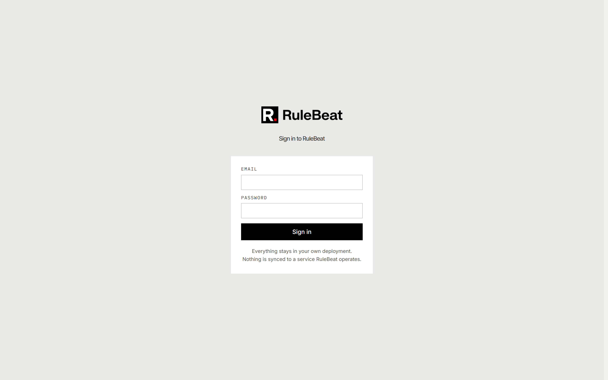
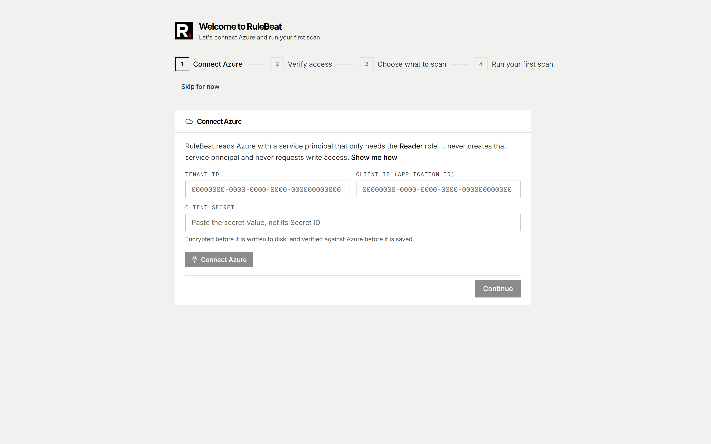
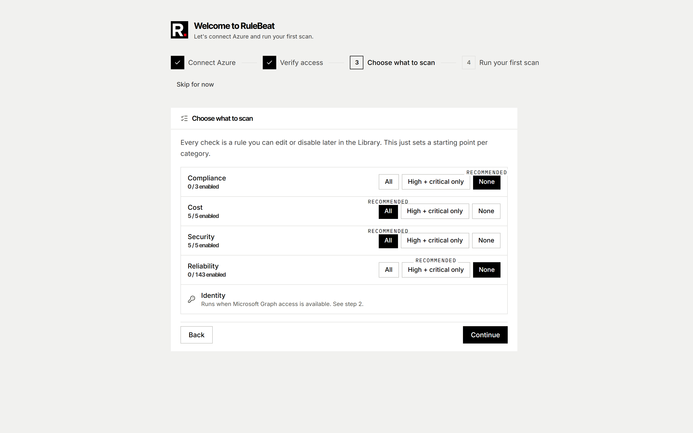
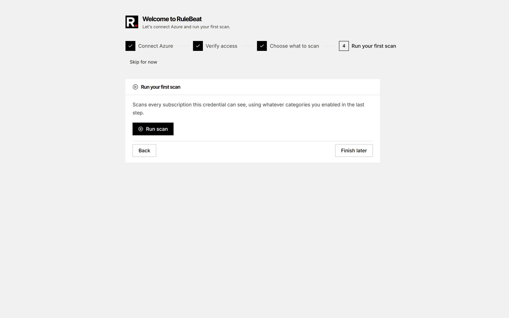

# Installing RuleBeat

## Docker (recommended)

### Prerequisites

- Docker and Docker Compose
- An Azure subscription with at least Reader access, if you want to connect real Azure data (you
  can also explore the UI without connecting anything)

### Run it

1. Pull and start the published image.

   bash or zsh:

   ```bash
   docker run -d --name rulebeat --restart unless-stopped -p 127.0.0.1:3000:3000 \
     -v rulebeat-data:/app/packages/web/data \
     -e AUTH_URL=http://localhost:3000 \
     ghcr.io/rulebeat/rulebeat:0.2.0
   ```

   PowerShell:

   ```powershell
   docker run -d --name rulebeat --restart unless-stopped -p 127.0.0.1:3000:3000 `
     -v rulebeat-data:/app/packages/web/data `
     -e AUTH_URL=http://localhost:3000 `
     ghcr.io/rulebeat/rulebeat:0.2.0
   ```

   Reach RuleBeat at `http://localhost:3000`. The port binding is deliberately loopback-only:
   RuleBeat holds a live Azure read credential and has no TLS of its own, so it is reachable from
   this machine and nowhere else until you put a reverse proxy in front of it.

   `AUTH_URL` is the address RuleBeat treats as its own. It is set here because Entra ID accepts a
   Microsoft sign-in redirect URI only over HTTPS or on `http://localhost`, and refuses an IP
   address: browsing `127.0.0.1` produces a redirect URI no app registration can be configured to
   match. If you set up Microsoft sign-in, register
   `http://localhost:3000/api/auth/callback/microsoft-entra-id` in Entra ID. A deployment behind a
   domain sets `AUTH_URL` to that domain instead, as described in [`configure.md`](configure.md).

2. Confirm the container reports healthy (it can take a few seconds to move past `starting`):

   ```
   docker inspect rulebeat --format '{{.State.Health.Status}}'
   ```

3. Continue with [First sign-in](#first-sign-in) below.

To build the image from source instead, clone the repo and let the committed Compose file build it
(its `build: .` points at the repo's own Dockerfile):

```
git clone https://github.com/rulebeat/rulebeat.git
cd rulebeat
docker compose up -d --build
```

Nothing else is required. A brand-new install with zero users seeds one local admin account with a
generated password on first boot. `--restart unless-stopped` means Docker brings the container back
on its own after a crash or host reboot. The image also ships a `HEALTHCHECK` (the `Health.Status`
you inspected above) that `docker run` and Compose both use to know the app is actually serving
traffic, not just that the process started.

Pin a specific version rather than `:latest`; see [Upgrading](#upgrading) below for why, and for
where to find the current version. `:latest` is still published if you want it, at the same risk as
any always-newest tag: the running version can change under you with no record of when. Every
published image is signed and carries an SBOM and build provenance you can verify yourself; see
[Verifying a published image](security.md#verifying-a-published-image) in the security docs.

Prefer Compose? Save this as `docker-compose.yml` and run `docker compose up -d`:

```yaml
services:
  rulebeat:
    image: ghcr.io/rulebeat/rulebeat:0.2.0
    restart: unless-stopped
    ports:
      - "127.0.0.1:3000:3000"
    environment:
      AUTH_URL: http://localhost:3000
    volumes:
      - rulebeat-data:/app/packages/web/data
volumes:
  rulebeat-data:
```

The repo's own [`docker-compose.yml`](../../docker-compose.yml) is the long-form version of this
file: it builds from source (`build: .`) and documents every environment variable RuleBeat reads,
each one optional, with a comment saying what it's for. Use it as the reference when you want a
deployment to [arrive pre-configured](#arriving-pre-configured).

Bound to `127.0.0.1` on purpose: RuleBeat holds a live Azure read credential and does its own
authentication but has no TLS story of its own, so the default is "reachable from this host only."
To reach it from elsewhere, put a reverse proxy with TLS in front and point it at `127.0.0.1:3000`;
see [`configure.md`](configure.md#exposing-it-beyond-localhost).

Either way, everything (the SQLite database, the generated admin password, the auth secret, and
the encryption key) lives in the `rulebeat-data` named volume. Back that up, not the container.

### First sign-in

1. Read the generated admin password. It's written to `data/initial-password.txt` inside the data
   volume, never to the container logs, so it doesn't outlive the forced password change in your
   log history:

   ```
   docker exec rulebeat cat data/initial-password.txt
   ```

2. Open `http://localhost:3000` and sign in with it.

   

3. Change the password when prompted. That's expected: the generated password is meant to be used
   exactly once.

4. Follow the <!-- count:onboarding-steps -->four-step wizard that opens next: connect Azure,
   verify what the credential can reach, choose what to scan, and run a first scan. See
   [`permissions.md`](permissions.md) for the identity it asks for.

   

   

   

### Arriving pre-configured

Everything above works with a completely empty `.env`, and everything it sets up (Azure
connection, Microsoft sign-in) can also be configured later from the console after signing in. If
you'd rather a deployment arrive already configured (for automation, or so a first sign-in doesn't
need a follow-up trip to Settings), set the relevant environment variables before the first boot.
Environment variables always win over anything entered in the console, so a template deployment
never falls back to showing a setup screen. See [`configure.md`](configure.md) for the full list.

### Upgrading

A running instance shows its version in the sidebar footer and on the admin Diagnostics page's
System card; the [releases page](https://github.com/rulebeat/rulebeat/releases) shows the newest
one. Pull a specific tag rather than `:latest`: a pinned tag means you upgrade on your own schedule
and can always see which version you're running.

1. Pull the new version's image: `docker pull ghcr.io/rulebeat/rulebeat:0.2.0`
2. Remove the old container: `docker stop rulebeat && docker rm rulebeat` (the data volume is
   untouched by this).
3. Start the new one with the same command as the install.

   bash or zsh:

   ```bash
   docker run -d --name rulebeat --restart unless-stopped -p 127.0.0.1:3000:3000 \
     -v rulebeat-data:/app/packages/web/data \
     -e AUTH_URL=http://localhost:3000 \
     ghcr.io/rulebeat/rulebeat:0.2.0
   ```

   PowerShell:

   ```powershell
   docker run -d --name rulebeat --restart unless-stopped -p 127.0.0.1:3000:3000 `
     -v rulebeat-data:/app/packages/web/data `
     -e AUTH_URL=http://localhost:3000 `
     ghcr.io/rulebeat/rulebeat:0.2.0
   ```

With Compose, update the `image:` tag in your `docker-compose.yml` first, then
`docker compose pull && docker compose up -d`.

Migrations run automatically against the existing data volume on startup. RuleBeat's own test
suite includes an upgrade path test that synthesizes old database shapes and asserts a user's
rules, findings, dashboards, users, and suppressions all survive an upgrade unchanged, specifically
because migrations are the place data loss tends to hide.

## Demo mode

To show RuleBeat around before connecting a real tenant, run it in demo mode: `RULEBEAT_DEMO=1`
against a generated synthetic database. Anonymous, read-only, and structurally unable to reach a
real Azure tenant. Generating that database needs a source checkout (the published Docker image
doesn't ship the generator), so demo mode is something you run from the repo, not from this page's
container install. See [`demo-mode.md`](demo-mode.md).

## Deployment topology

The supported shape is **one replica, one data volume.** That's what's tested, and what the
scheduler and SQLite storage are actually built for.

Running more than one replica against the same volume isn't supported today. Two things stand in
the way:

- **The background scheduler has no cross-instance coordination.** Each replica's 30-second poll
  loop and busy flag are in-process only, so two replicas both see the same due schedule and both
  run it, sending duplicate notifications and duplicate scan history. Setting
  `RULEBEAT_DISABLE_SCHEDULER=1` on every replica but one avoids the duplicate firing, but it's a
  manual workaround you have to remember to apply, not a real high-availability story.
- **SQLite is a single-writer database.** It's fine on a local volume mounted by one container; it
  is not built for concurrent writers across replicas, even with the scheduler issue above solved.

If you need more headroom than one container gives you, scale the container vertically rather than
horizontally for now. Multi-replica support (leader election for the scheduler, a real database
backend) is on the roadmap but not built.

`AUTH_SECRET` and `RULEBEAT_ENCRYPTION_KEY` being settable to the same value across replicas (see
[`configure.md`](configure.md)) is about session and credential compatibility if you experiment
with more than one instance. It doesn't mean the scheduler or database problems above are solved.

## Local development

For contributing to RuleBeat itself, or running it outside Docker:

```bash
npm install
npm run build:core      # build packages/core before running or typechecking web
npm run dev             # http://localhost:3000
```

Copy `.env.example` (repo root) to `packages/web/.env.local` and fill in values. Run `az login`
for local Azure credential access; outside a container, `DefaultAzureCredential` falls back to
your own CLI session if nothing else is configured.

```bash
npm test                # everything, both packages
npm run test:watch      # watch mode while working
npm run typecheck       # typecheck both packages, from the repo root
```

`packages/web` imports `@rulebeat/core` from its compiled output, not its source, so
`npm run build:core` has to run (or re-run, after a core change) before `npm run dev` or a
typecheck picks up the change.
