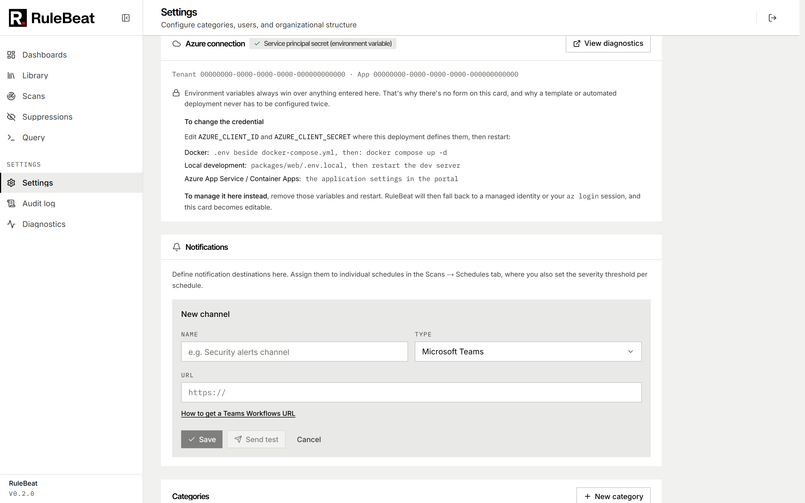

# Notifications

Channels are an address book, schedules decide who hears about what, only *new* findings from
*scheduled* runs are sent, and every attempt is recorded.

**Channels** live under Settings → Notifications: a name, a type and a destination, knowing nothing
about schedules or severities. **Schedules** pick channels, and each assignment carries its own
minimum severity and optionally which categories and subscriptions that channel should hear about, so
one channel can serve several schedules at different thresholds.

When a scheduled run finishes and its findings are synced, RuleBeat works out which are *new* in that
run (first seen now, not "still there"), applies each assignment's scope and then its severity, and
sends one message per channel if anything is left. Manual runs never notify, a run with no new
findings sends nothing, and an already-active finding is not re-sent.

## Channel types

<!-- count:channel-types -->Four types:



**Microsoft Teams.** Teams no longer accepts the old Office 365 connector webhooks, so RuleBeat posts
an Adaptive Card (schema 1.5) to a **Power Automate Workflow** URL. In the Teams channel, open
Workflows, use the template "Post to a channel when a webhook request is received", and paste the
HTTPS URL it gives you.

**Slack.** Paste an Incoming Webhook URL. The message is Block Kit.

**Email.** SMTP on the channel: host, port, TLS mode (none, STARTTLS, implicit), username, password,
from address, comma-separated recipients. The password is stored encrypted like a webhook URL. Plain
text only, with the top ten findings.

**Generic webhook.** Any HTTPS endpoint accepting JSON. RuleBeat POSTs this stable shape:

```json
{
  "event": "scan.new_findings",
  "runId": "…",
  "triggeredBy": "schedule",
  "counts": { "critical": 1, "high": 3 },
  "totalNewFindings": 4,
  "findings": [
    {
      "fingerprint": "…",
      "title": "Storage Account Allows HTTP Traffic",
      "severity": "medium",
      "category": "security",
      "resourceId": "/subscriptions/…/providers/Microsoft.Storage/storageAccounts/…",
      "resourceName": "stportal8rganalyticsprod",
      "subscriptionId": "…"
    }
  ],
  "scansUrl": "https://rulebeat.example.com/scans?…"
}
```

`findings` carries at most the first 20 while `totalNewFindings` is the real count, and `counts` has
a key only for severities that occurred. Point a Logic App, a ticketing webhook or your own function
at it.

The Teams, Slack and email messages all carry the same header, a severity summary and a link back at
`<public URL>/scans`, filtered to new findings over the last seven days. That public URL is the one
under Settings → Sign-in (`AUTH_URL` in the environment), so set it before wiring channels or the
links will be wrong. See [`configure.md`](configure.md).

## Test sends, retries and history

Settings → Notifications has a per-channel test that sends one sample finding through the real
delivery path, against a saved channel or the values in the form. It needs the admin role.

Webhook channels get up to **three attempts**, waiting 2 then 8 seconds, each timing out after 10. A
network error, timeout, HTTP 429 or any 5xx is retried; any other 4xx is not, because a rejected
request repeated is the same rejection. Email is a single attempt. Every attempt sequence is recorded
per channel with its status and response detail, keeping the most recent 50.

Sending is an outbox rather than fire-and-forget: a run records that notifications are pending,
the process about to send them claims the batch, dispatch happens, the run is marked sent. If the
process restarts in between, recovery dispatches the pending ones, at the next start and on every
scheduler tick. The claim is what keeps two containers overlapping during a rolling deploy from
both sending the same batch; a claim whose owner died is taken over after five minutes. A restart
delays a notification; it does not lose it.

## Where a destination is allowed to point

Before any webhook request, RuleBeat resolves the destination hostname and refuses to send if it
points anywhere private: loopback, RFC 1918, link-local (including the metadata address
169.254.169.254), carrier-grade NAT, reserved and multicast ranges and their IPv6 equivalents, plus
any scheme other than `http` or `https`. Redirects are not followed, and a destination answering with
one is treated as a refusal. This stops the server being used to probe its own network, and it
applies to test sends too. A corporate receiver on a private address is unreachable by design; put it
behind a public hostname or use email.

## What is not here

No digest or batching across runs, no quiet hours, no per-rule routing, no HTML email. Notifications
cover new findings only: a fixed finding, a failed run or a stale schedule sends nothing. The Scan
Coverage widget is where a stopped schedule shows.
