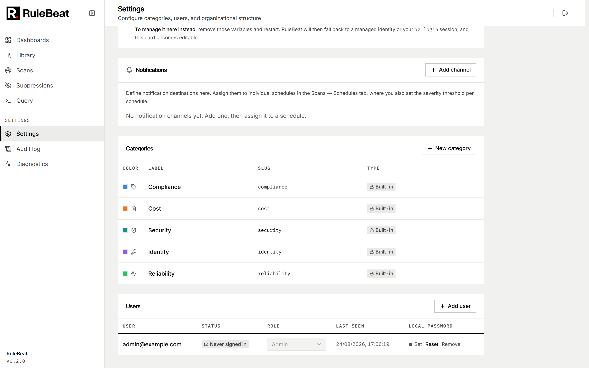

# Roles and permissions

RuleBeat has <!-- count:roles -->three roles: **viewer**, **editor** and **admin**, cumulative in
that order. Every API route names the specific action it performs (`rules:write`, `scans:run`, and
so on) rather than a role rank, so this table is the single place the mapping lives:

| Action | Viewer | Editor | Admin |
|---|:---:|:---:|:---:|
| Read and export everything (findings, rules, dashboards, scans) | ✅ | ✅ | ✅ |
| Author, edit, delete, or test-validate rules | | ✅ | ✅ |
| Run a manual scan | | ✅ | ✅ |
| Create or edit schedules | | ✅ | ✅ |
| Suppress a finding | | ✅ | ✅ |
| Create, edit, or delete dashboards | | ✅ | ✅ |
| Refresh the resource-type schema cache | | ✅ | ✅ |
| Create or edit categories | | | ✅ |
| Manage users and their roles | | | ✅ |
| Read the audit log | | | ✅ |
| Manage the Azure scanning connection | | | ✅ |
| Manage sign-in configuration (local policy, Microsoft Entra ID) | | | ✅ |
| Manage notification channels | | | ✅ |

Every account, viewer included, can change its own password. That sits outside the ladder: it is
not something one role grants another.

A role is looked up from the local `users` table on every request that needs one, never carried on
the session token, so a demotion or a removed account takes effect on the very next request rather
than when a token expires.

## Provisioning

A brand-new install with zero users seeds one local admin account with a generated password, forced
to change on first sign-in ([`install.md`](install.md)). From there an admin can add local accounts
from Settings → Users with their role chosen up front, or configure Microsoft Entra ID sign-in
([`configure.md`](configure.md)) so people use their work account. A user's row can be created by
email before they have ever signed in; the account binds to their identity on first login.

`RULEBEAT_INITIAL_ADMIN` names a work email that becomes an admin automatically on first Microsoft
sign-in. It doubles as the lockout recovery path if every admin is ever removed: set it and restart.

## Audit log

Every mutation, not just the sensitive ones, writes a row: who did it, what action, a human-readable
summary, and the names of the fields that changed. Never the values, so a secret is never written to
the log even indirectly. Only admins can read it, from Settings → Audit log.
