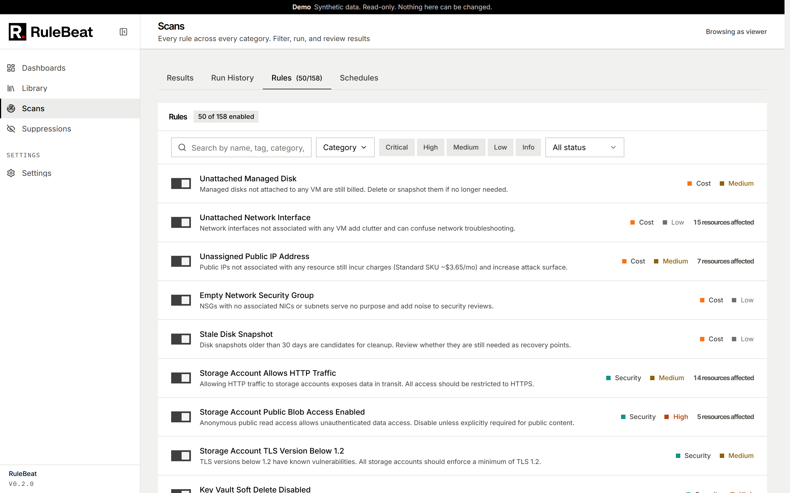
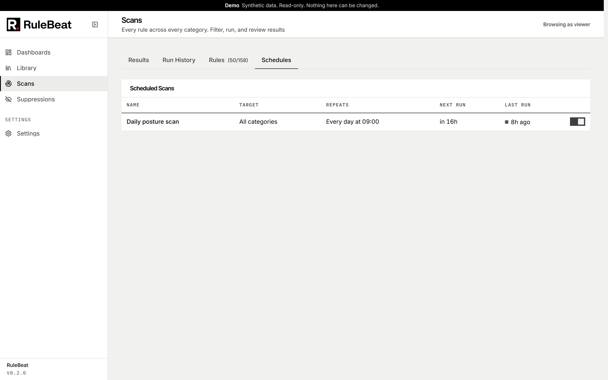

# Scans and schedules

Everything scan-related lives on one Scans page, under four tabs: **Results** (current findings,
filterable by category, severity, status and more), **Run History** (every past run and its
coverage), **Rules** (every rule with its enabled state and last outcome), and **Schedules**.
Category is a filter on each tab, not a separate page.

## Manual scans

Run Scan executes a set of rules immediately against your configured Azure identity and shows
results as soon as it finishes. A manual run never notifies, even when it covers rules a schedule
elsewhere is also watching. Manual and scheduled runs never overlap: an in-progress run holds a busy
flag, so a schedule firing mid-scan waits rather than running concurrently against the same tenant.

## Scheduled scans

Schedules poll every 30 seconds for anything due, backed by a hand-written recurrence engine rather
than cron, since cron alone cannot express "every 3 weeks" or a pattern anchored to an arbitrary
start date.

**Recurrence** is one of once, hourly, daily, weekly (on the days you pick, every N weeks) or
monthly (on a day of the month, every N months, falling back to the last day where that day does not
exist). Every type takes an end condition: never, or on a date.

**Targeting** is one of four: all enabled rules, the categories you pick, the tags you pick (any
enabled rule carrying at least one), or specific rules. Directory rules are reachable through every
targeting mode, tags and specific-rule lists included.

Notification channels are assigned per schedule, along with the minimum severity and optional
category and subscription scope for each. See [`notifications.md`](notifications.md).

## Disable, clear findings, or suppress

Three controls make findings go away, and they mean different things.

- **Disable the rule**, with the toggle on the Rules tab. The rule stops being scanned. Its
  findings are left exactly as they were, still listed and still counted, because no scan looks at
  them again and only a rule that ran can mark its own findings fixed. Use it for a rule that is
  right but not wanted right now.
- **Clear findings**, next to the affected count on the Rules tab (editor and admin). Deletes
  every finding the rule has ever produced, active and fixed, together with their history, and
  keeps the rule. Use it when the rule turned out to be wrong: the findings were never real, so
  marking them fixed would record remediation nobody did. Built-in rules can have their findings
  cleared even though they cannot be deleted. If the rule is still enabled, the next scan that runs
  it recreates whatever still matches and notifies about each one as new, so disable the rule
  first unless a clean baseline is what you want. Suppressions are kept, so a finding that comes
  back is still suppressed. Past runs in Run History and past days on the trend charts keep their
  original counts. The action is written to the audit log with the number of findings removed.
- **Suppress a finding** ([`suppressions.md`](suppressions.md)) records that one finding is real
  but accepted. It hides that finding from the figures without deleting anything.

## Run history

Every run, manual or scheduled, is recorded with its outcome, duration and which rules it covered.
The Schedules table shows each schedule's name, target, recurrence, next run and last run, with a
status indicator that refreshes automatically.

A scan is not a bare list of findings: every rule in a run ends with exactly one outcome, only a
successful rule may mark its old findings fixed, and a run with any non-success outcome is badged
**partial** coverage rather than folded into the posture number. The outcome model is in
[`how-it-works.md`](how-it-works.md#one-outcome-per-rule), and what "X of Y passing" counts is in
[`posture.md`](posture.md).
