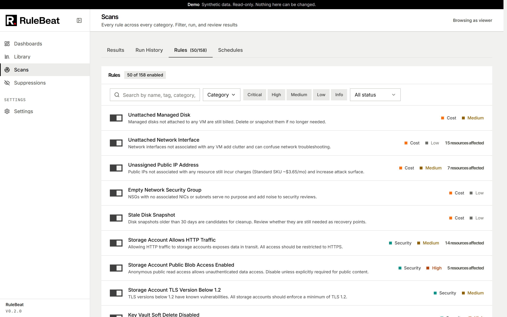
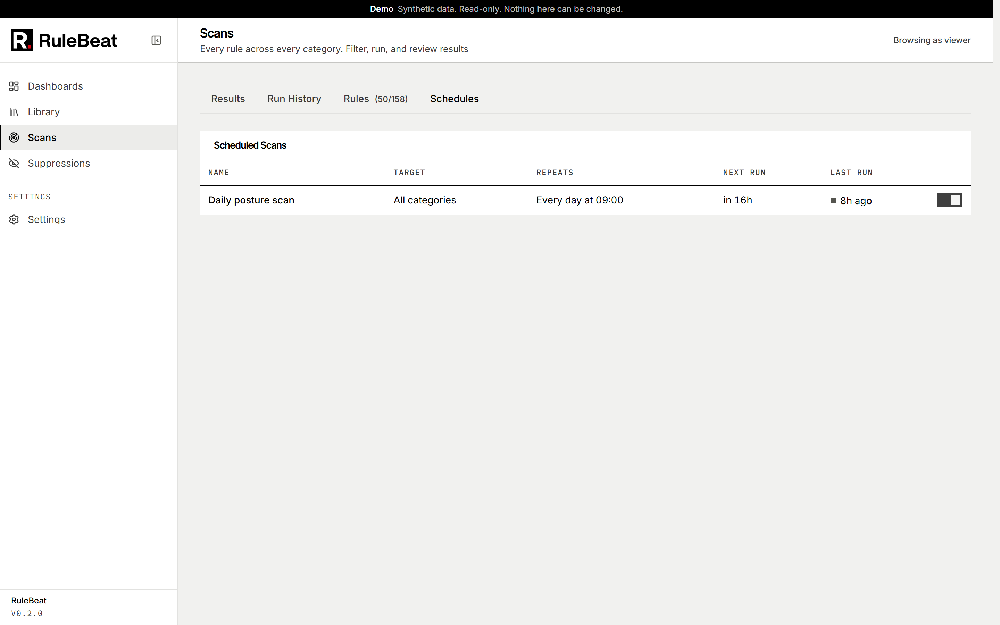
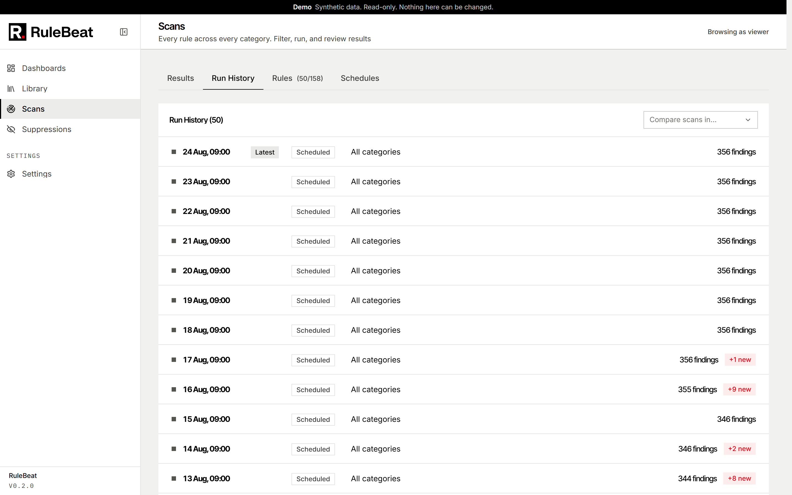

# Scans and schedules

Everything scan-related lives on one Scans page, under six tabs: **Results** (current Problems,
filterable by category, severity, status and more), **Advisories** (findings of Advisory rules),
**Activity** (findings of Log Analytics rules), **Run History** (every past run and its coverage),
**Rules** (every rule with its enabled state and last outcome), and **Schedules**. Category is a
filter on each tab, not a separate page.

Each finding is listed on exactly one of the first three tabs, by its rule's kind, so the Results
table lists the same findings its tiles count. An Activity finding is something that happened, not
something still wrong: it is never fixed, so the Activity tab has no Fixed status, tile or column.
It lists each pattern (the rule's dimension value, for example a user) with when it was last seen
and how many times it has been seen.

## Manual scans

Run Scan executes a set of rules immediately against your configured Azure identity and shows
results as soon as it finishes. A manual run never notifies, even when it covers rules a schedule
elsewhere is also watching. Manual and scheduled runs never overlap: an in-progress run holds a busy
flag, so a schedule firing mid-scan waits rather than running concurrently against the same tenant.

## Scheduled scans

Schedules poll every 30 seconds for anything due, backed by a hand-written recurrence engine rather
than cron, since cron alone cannot express "every 3 weeks" or a pattern anchored to an arbitrary
start date.

**Recurrence** is one of once, hourly, daily, weekly (on the days you pick, every N weeks) or
monthly (on a day of the month, every N months, falling back to the last day where that day does not
exist). Every type takes an end condition: never, or on a date.

**Targeting** is one of four: all enabled rules, the categories you pick, the tags you pick (any
enabled rule carrying at least one), or specific rules. Directory rules are reachable through every
targeting mode, tags and specific-rule lists included.

Notification channels are assigned per schedule, along with the minimum severity and optional
category and subscription scope for each. See [`notifications.md`](notifications.md).

A due schedule is claimed before its scan starts: one conditional database update moves its next
run forward, so two RuleBeat containers overlapping during a rolling deploy cannot both run it.
While a scan runs, its row in Run History carries a heartbeat refreshed every 30 seconds. A run
whose heartbeat is more than five minutes old is marked as not completed at the next start or
scheduler tick, with the findings it had already recorded kept and its notifications, if any were
due, sent then. A run interrupted that way is not re-run at boot; the schedule waits for its next
occurrence.

## Filter, columns and sort on the Results, Advisories and Activity tabs

All three tabs filter, sort and page the same way. Besides the built-in filters, in the By resource view
the Columns menu lists every field the rules' queries returned. Pick a field to show it as a column,
then use its header to sort or to filter by its values. The Add filter button in the toolbar
filters by any built-in field or any returned field: pick the field, then tick values among those
the current findings hold. Every active filter, from the toolbar, a column header or Add filter,
shows as a chip, and the chip's cross removes that value. A filter is a set of accepted values; a
finding with several returned rows is kept when at least one row passes every returned-field filter,
and only those rows are shown and exported. Empty values sort last in both directions, and numbers
sort as numbers. The whole view is in the address, so a link reproduces it: `cols` for the columns,
`sort` as `field:asc` or `field:desc` (a returned field is written `row.<name>`), `rf` for a
returned-field filter (`rf=feature=Retiring|Preview` keeps rows whose value is one of those), `f`
for the other built-in fields (`f=resourceName=vm1`, `f=firstSeen=2026-10-01`), and `page`. In a
value, write `\,`, `\|`, `\=` and `\\` for a comma, bar, equals sign and backslash; anything else,
including `%` and spaces, is written as it is. A returned field no finding has gives an empty column
and a filter that keeps nothing.

### Group by

The Group by button in the By resource toolbar groups the list by one or more fields, the same
built-in and returned fields Add filter offers. Pick a field to add it, and use the arrows to move
it earlier or later: groups nest in that order. Each group shows its value, the number of resources
in it and the number of rows, and opening it shows the groups under it or, at the last level, the
resources, 50 to a page with a pager of their own. Grouping is over rows, so a resource with rows in
two groups appears under both, and its row count in each is only the rows that fall in that group.
Rows with no value for a field go in a No value group, which comes last whichever way groups are
sorted. Groups sort by value or by resource count, ascending or descending, at every level. Sorting
by value follows what the header shows: rules, categories and subscriptions go by name, and
severities go from critical down, with any severity outside critical to info last in both
directions. The top
level is paged too, and filters apply before grouping, so a returned-field filter narrows the rows
that are grouped. The counts at the top of the page, the tiles and the exports do not change.

To rebuild the Azure Advisor service retirement workbook, group the Service retirements rule by its
retiring feature, then by its retirement date. Each feature shows how many resources it affects,
each date under it shows the resources retiring then, and the affected resources are listed
underneath. In the address, `group` lists the fields in order (`group=row.retiringFeature,row.retirementDate`)
and `gsort` holds the group sort as `value:asc`, `value:desc`, `count:asc` or `count:desc` (left out
when it is `value:asc`). Fields are written as in `sort` and `rf`, so `\,` stands for a comma inside
a field name.

### Saved views

The Views button in the toolbar keeps the current view under a name, and the view is shared with
everyone on the install. A saved view holds the tab it was saved on (Results or Advisories) and
everything the address carries: filters, search, window, picked columns, sort and grouping. It does not hold
the page you were on, which findings are suppressed, or the By resource and By rule choice. Choose
a saved view in the menu to open it. The menu lists the views for the tab you are on, and opening
one puts its filters in the address, so the link still reproduces what you see.

Viewers can open saved views. Editors and admins can also save the current view, replace an open
view's filters with the current ones (Update with current view), rename it and delete it. A name
is unique whatever its case, and saving a name already in use says so. A saved view stores the
columns and filters by name, so a view that mentions a returned field no finding has yet still
opens, with an empty column and a filter that keeps nothing, as it does in a link. Deleting a saved
view never changes findings. The audit log records each save, update, rename and delete with the
names of the fields that changed, never their values.

## Disable, clear findings, or suppress

Three controls make findings go away, and they mean different things.

- **Disable the rule**, with the toggle on the Rules tab. The rule stops being scanned. Its
  findings are left exactly as they were, still listed and still counted, because no scan looks at
  them again and only a rule that ran can mark its own findings fixed. Use it for a rule that is
  right but not wanted right now. To disable or enable many rules at once, select them with the
  checkboxes on the Rules tab (editor and admin), or use the checkbox above the list to select
  every rule the current filters show, then pick the action. Each action changes only the selected
  rules it applies to, and a rule hidden by the filters drops out of the selection.
- **Clear findings**, next to the affected count on the Rules tab (editor and admin). Deletes
  every finding the rule has ever produced, active and fixed, together with their history, and
  keeps the rule. Use it when the rule turned out to be wrong: the findings were never real, so
  marking them fixed would record remediation nobody did. Built-in rules can have their findings
  cleared even though they cannot be deleted. If the rule is still enabled, the next scan that runs
  it recreates whatever still matches and notifies about each one as new, so disable the rule
  first unless a clean baseline is what you want. Suppressions are kept, so a finding that comes
  back is still suppressed. Past runs in Run History and past days on the trend charts keep their
  original counts. The action is written to the audit log with the number of findings removed.
- **Suppress a finding** ([`suppressions.md`](suppressions.md)) records that one finding is real
  but accepted. It hides that finding from the figures without deleting anything.

## Run history

Every run, manual or scheduled, is recorded with its outcome, duration and which rules it covered.
The Schedules table shows each schedule's name, target, recurrence, next run and last run, with a
status indicator that refreshes automatically.

A scan is not a bare list of findings: every rule in a run ends with exactly one outcome, only a
successful rule may mark its old findings fixed, and a run with any non-success outcome is badged
**partial** coverage rather than folded into the posture number. The outcome model is in
[`how-it-works.md`](how-it-works.md#one-outcome-per-rule), and what "X of Y passing" counts is in
[`posture.md`](posture.md).

### A past run's findings

Open a run, then one of its category scans, to see the findings that scan returned, as they were
found. The list is read from the server 50 at a time, so a run with tens of thousands of findings
opens as fast as a small one. Every finding the scan returned is listed, including ones you have
suppressed since: the list is a record of the run, not a view of what is open now. It carries each
finding's severity, rule, resource name, type, resource group and row count, and it has no
suppress or script actions and no status.

Filter by severity or by rule, or search the resource name, rule name, type and resource id (a
match anywhere in the text, whatever the case). The severity and rule menus show how many findings
each value has under the other filters. The export button downloads every matching finding, not just
the page on screen, as CSV or JSON, with the same column headers as the table. A large export is
streamed, so it starts at once and never builds the whole file in memory.

A past run keeps each finding as it was found, not its rows or its status. A finding that still
exists links to the live finding on its own tab (Results, Advisories or Activity), where its rows
and status are. A finding that has since been cleared is listed with "No longer
exists" and no link. The page says why when there is nothing to show: the run returned no findings,
nothing matches the search and filters, the run was not found or has aged out of Run History, a
run from an earlier version whose stored findings could not be read when RuleBeat upgraded is not
available (the server log names the reason at startup, and RuleBeat tries again at each start), or
the request failed.

The filters, the search and the page are in the address (`snapSeverity`, `snapRule`, `snapQ` and
`snapPage`), after `scan=`, so a link reproduces what you see. A `scan=` link made before these
existed opens the same run, unfiltered, on its first page.
