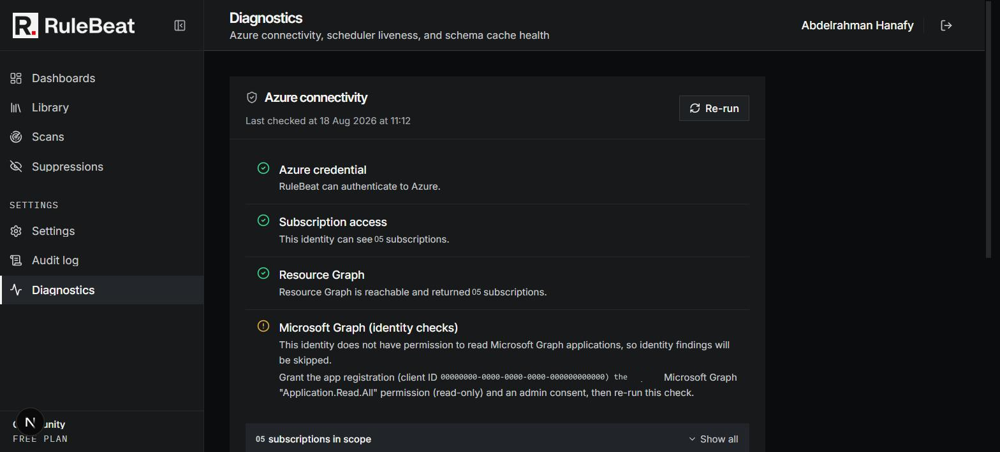

# Troubleshooting



## Start with the diagnostics page

`/diagnostics` (admin-only, linked from Settings) answers the questions that would otherwise need a
server log, on two cards.

**Azure connectivity** runs four checks, in order, since a later one can only fail meaningfully if
the ones before it pass. They run when you click Run, not on page load, and the last result
survives a refresh.

1. **Azure credential.** Can RuleBeat get a token at all? A failure means the credential itself is
   wrong ([`configure.md`](configure.md), [`permissions.md`](permissions.md)).
2. **Subscription access.** How many subscriptions can this identity see? Zero means Reader is not
   assigned anywhere it can reach.
3. **Resource Graph.** Can it query, and does the subscription count match the previous check? A
   mismatch usually means Reader is assigned somewhere Resource Graph has not indexed yet, which can
   lag a fresh role assignment by a few minutes.
4. **Microsoft Graph (Directory rules).** Optional. A warning here, not a failure, means Directory
   rules are skipped and everything else works normally. Grant `Application.Read.All` to fix it.

Every summary is a hand-written plain-language sentence. The real underlying error, which can carry
tenant and correlation IDs you would not want in a screenshot, always goes to the server log first.

**System** is local state with no Azure calls, so it loads on its own. Its title carries the running
version, which is what to quote in a bug report. Below it, **Scheduled scans** shows whether the
scheduler is enabled and when it last ticked (every 30 seconds when running; "disabled at the server
level" means `RULEBEAT_DISABLE_SCHEDULER` is set), and **Azure resource schemas** shows whether the
rule builder's resource-type cache is populated and fresh. A stale individual entry is normal and
self-heals; only an empty cache or an outdated type list is worth acting on.

## Common issues

**Stuck on the sign-in page after entering credentials.** Confirm `AUTH_URL` matches how you are
actually reaching the instance, scheme and port included. A mismatch between the configured URL and
the request's origin is the most common cause of a sign-in that appears to succeed but loops back.

**A fresh Docker install will not build or start.** Check `docker compose logs` first; most
first-boot failures show a clear error there, and the generated admin password is never in it
([install.md](install.md#first-sign-in)). Then ask Docker what its own liveness check sees:

```
docker inspect rulebeat --format '{{.State.Health.Status}}'
```

`starting` for the first few seconds is normal. Stuck on `starting`, or `unhealthy`, means the app
process is not answering HTTP, which points at the log rather than at Azure. `RestartCount` climbing
without settling means it is crash looping, and the log from just before each restart is where to
look.

**A schedule shows as due but never runs.** Check the System card's Scheduled scans row, then
confirm no other run is in progress: runs are serialized, so a long scan delays the next one.

**A notification channel is not firing.** Check its delivery history from Settings → Notifications.
The usual cause of "configured but nothing arrives" is that the schedule was never assigned to the
channel, or the severity threshold on that assignment is above what the run produced.

RuleBeat logs to stdout, so `docker compose logs -f` is where startup errors and scan failures show
up. It never returns a raw internal error to the browser: the real error goes to the log and a
stable, safe message goes to the UI, so a generic message on screen means the log has the cause.
